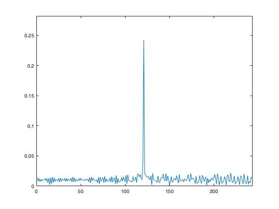
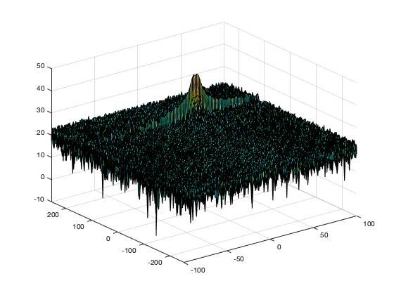
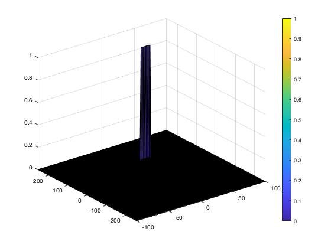

# Report Final Assignment

The full code + readme is available [in Github](https://github.com/MichaelSteurer/UdacityRadar).


## FMCW Waveform Design

The wave form is computed as described in the course:

```matlab
...
bSweepHz = c / 2 * rangeResolution;

Tchirp = 5.5 * 2 * (maxRange / c);

slope = bSweepHz / Tchirp;
...
```

The resulting value for the slope is _20454.5455 GHz/s_.

The full implementation can be found in the [Github file](https://github.com/MichaelSteurer/UdacityRadar/blob/master/assignment.m#L31).


## Simulation Loop

The beat signal (_Mix(i)_) is computed by element-wise multiplication of the transmitted signal and the received signal:

```matlab
for i=1:length(t)             
    rangeOfTarget = targetInitialDistance + t(i)*targetInitialVelocity;

    % Tx(i) = cos(2 * PI * (fc * t + alpha * t^2 / 2))
    Tx(i) = cos(2 * pi * (fc * t(i) + slope * t(i)^2 / 2));

    % Rx (i) = cos(2 * pi * (fc * (t-tau) + alpha * (t-tau)^2 / 2 ))
    tau = rangeOfTarget * 2 /c;
    Rx(i) = cos(2 * pi * (fc * (t(i) - tau) + slope * (t(i) - tau)^2 / 2 ));
    
    Mix(i) = Tx(i) .* Rx(i);
end
```

The full implementation can be found in the [Github file](https://github.com/MichaelSteurer/UdacityRadar/blob/master/assignment.m#L74).


## Range FFT (1st FFT)

The beat signal is now transferred from the time-domain into the frequency domain using the _fft(.)_ function. We use the normalised output, get the absolute values and remove the left side (negative frequencies) as it is just a mirrored image of the positive frequencies.

```matlab
signal = reshape(Mix, [Nr Nd]);
signalFFT = fft(signal);
signalFFT = abs(signalFFT / Nr);
signalFFT = signalFFT(1:Nr/2+1);
```



_Fig_: The beat signal in the frequency domain.

---


The full implementation of this step can be found in the [Github file](https://github.com/MichaelSteurer/UdacityRadar/blob/master/assignment.m#L89).


## 2D CFAR

The 2nd FFT was already implemented in the given file. The resulting Range Doppler Map RDM look as follows:



_Fig_: The Range Doppler Map RDM as implemented in the given code.

---

To reduce the noise in the RDM and highlight the peak we implement a simple CFAR algorithm. We iterate a rectangular window with guard and training cells through the whole map, sum the signal levels of the training cells and normalise it. We then compare the summed level with respect to a threshold to the CUT level. Based on this comparison we assign 0 or 1 to a new matrix. This matrix has the same dimensions as the RDM map and is initialised with 0s. This keeps the cells close to the edge that were not processed at level 0. Another option would be to overwrite the cells in the RDM matrix and then set all cells != 1 to 0.

The code is similar to what we saw in video of the project description:

```matlab

% output matrix with size of RDM with zeros
% this is necessary as we do not process the edge cells in the next loop
thresholdBlock = zeros(size(RDM));

for i = (Tr + Gr) + 1 : Nr/2 - (Gr + Tr)
    for j = (Td + Gd) + 1 : Nd - (Gd + Td)
        noise_level = 0;

        % sum up all the trainings cells 
        for p = i - (Tr + Gr) : i + (Tr + Gr)
            for q = j - (Td + Gd) : j + (Td + Gd)
                if (abs(i-p) > Gr || abs(j-q) > Gd)
                    noise_level = noise_level + db2pow(RDM(p, q));
                end
            end
        end

        % normalise the nois level to get the threshold
        threshold = pow2db(noise_level / (2 * (Td + Gd + 1) * 2 * (Tr + Gr + 1) - (Gr * Gd) - 1));
        threshold = threshold + offset;
        
        % compare to the current cell (i/j) and set value in thresholdBlock
        CUT = RDM(i, j);
        if(CUT < threshold)
            thresholdBlock(i, j) = 0;
        else
            thresholdBlock(i, j) = 1;
        end
    end
end
```

Eventually we plot the values stored in th _thresholdBlock_. The cell sizes for training and guard cells used to create the plot are as follows: `Tr=10` and `Td=8` respectively `Gr=4` and `Gd=4`. The offset was selected as `offset=6`.




_Fig_: The result of the filter with the peak clear indicated.

---


The full implementation of this step can be found in the [Github file](https://github.com/MichaelSteurer/UdacityRadar/blob/master/assignment.m#L147).
